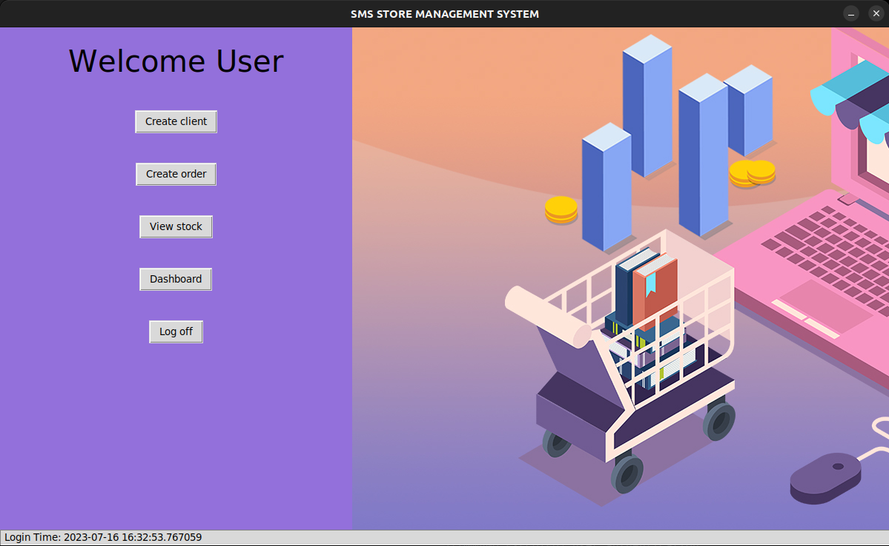

# Store Management Application

The Store Management Application is a GUI-based application built using `Tkinter`, a Python GUI toolkit and `MySQL`, a relational database. The application consists of a `client` and `server` sides that enable users to browse products, add them to the cart, and proceed with the order.



## Features

- Browse available products and view their details
- Add products to the cart
- Proceed with the order and generate a digital receipt
- Manage the store inventory and stock
- Handle client-server communication for seamless transactions

## Getting Started

### Prerequisites

- Python 3.6 or above
- Tkinter library (usually included in Python distributions)
- MySQL database

### Installation

1. Clone the repository:

   ```bash
   git clone https://github.com/derecklhw/tkinter_store_management_system.git
   ```

2. Navigate to the project directory:

   ```bash
   cd tkinter_store_management_system
   ```

3. Install the required Python libraries:

   ```bash
   pip install -r requirements.yaml
   ```

4. Install `MySQL server` or a `MySQL client` (e.g., MySQL Workbench) based on your needs and operating system:

   - For Ubuntu:

     ```bash
     sudo apt update
     sudo apt install mysql-server
     ```

     Refer to the tutorial from Digital Ocean on [How To Install MySQL on Ubuntu 20.04](https://www.digitalocean.com/community/tutorials/how-to-install-mysql-on-ubuntu-20-04) for detailted installation instructions.

   - For macOS:

     Install MySQL using `Homebrew`

     ```bash
     brew install mysql
     ```

   - For Window:

     Download the [MySQL Installer](https://dev.mysql.com/downloads/installer/) and follow the installation instructions.

5. Copy the `config.toml.example` file and rename it to `config.toml`.
6. Open the `config.toml` file in a text editor and update the MySQL connection details with your server's information. Make sure to provide the correct host, port, username, password, and database name.

   ```toml
   [database]
   host = "localhost"
   user = "your-username"
   password = "your-password"
   database = "your-database-name"

   [server]
   port = 5050
   header = 64
   format = "utf-8"
   ```

   Save the file after making the necessary changes.

7. Run the following command to create the database schema and insert records in tables:

   ```bash
   python create_database.py
   ```

8. Run the server-side application:

   ```bash
   python server.py
   ```

9. Run the client-side application:

   ```bash
    python client.py
   ```

   The application should now be up and running.

**Note**: The application has been developed and tested on Ubuntu and macOS environments. If you encounter any issues on other platforms, please report them.
